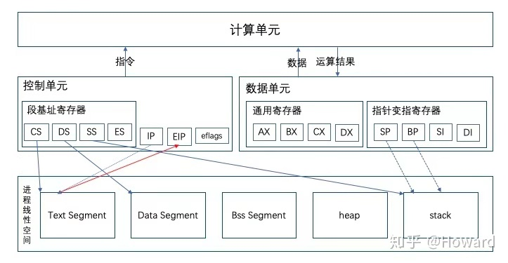

## 指令等价替换

涉及的问题:


1. 函数调用
2. 参数传递
3. 函数返回

```c
void test()
{}
```
```x86asm
0x80483db <test>                push   %ebp
0x80483dc <test+1>              mov    %esp,%ebp
0x80483de <test+3>              nop
0x80483df <test+4>              pop    %ebp
0x80483e0 <test+5>              ret
```


### call func

```x86asm
// 保存返回地址
push eip
// 跳转执行函数
jmp func
```
----

### enter(速度慢,会被优化为)

```x86asm
push  %ebp
mov   %esp, %ebp     # ebp = esp,  mov  ebp,esp in Intel syntax
sub   $n, %esp       # allocate space on the stack.  Omit if n=0
```

### leave
=>
```x86asm
// 把 sp 设置为 bp,释放整个栈空间
ESP = EBP
// EBP向栈顶方向移动一步,恢复成调用前的样子
EBP = Pop()
// 操作结束后,bs,bp 恢复到了调用函数之前的值
```

### ret

不改变寄存器的值,直接 jmp 到 eax 保存的地址

### push Source

=>(32 位机器)
```
// 栈指针
esp = esp - 4;(字长为 4),即栈向较低方向增长,小端操作系统
ss:esp = Source
```

### jmp Source


## 函数调用:

```c
int func(int a)
{
    // dsth
    return;
}


int main()
{
    // int a;
    func(a);
}
```

```x86asm
int func(int a)
{
    // 更新栈寄存器
    push ebp
    mov  ebp, esp
    // 取参数值
    pop a
    // dosth
    // 设置返回值
    mov eax retvalue
    // 恢复栈寄存器的值
    leave -> esp=ebp,pop ebp
    // 跳转到之前函数的地址
    ret -> pop return_addr,jump return_addr
}


int main()
{
    // 更新栈寄存器
    push ebp
    mov  ebp, esp
    // 准备func参数
    push a
    // 调用func
    call push -> push return address,jmp func
    // 获取func返回值
    eax
    // 其他
}
```
总结:从一个函数调用另一个函数的过程:

原函数调用开始
1. 参数压栈
2. 返回地址压栈
3. 将指令指针寄存器指向函数地址

调用函数开始.cpu 自动将栈指针更新

1. 栈基址压栈
2. 基址指针=栈指针

## 寄存器总结

SI
DI
SP
BP
CS
IP
DS
SS


SS SP维护栈地址.
SS:栈顶地址
SP:栈偏移地址



## 参考资料: 
- [x86 Instruction Set Reference](https://c9x.me/x86/)
- [维基百科: x86 calling conventions](https://en.wikipedia.org/wiki/X86_calling_conventions#x86-64_calling_conventions)
- [C语言函数调用栈](https://www.cnblogs.com/clover-toeic/p/3755401.html)

## 杂记

64 位系统下,syscall 是默认的进入内核态的指令.此命令在 32 位 intel 处理器下不可用.